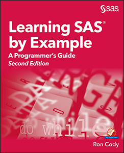

# Learning SAS by Example: A Programmer's Guide, Second Edition #
 
Ron Cody

This repository contains the sample code for the book *Learning SAS by Example: A Programmer's Guide, Second Edition*. 
Data files are SAS data sets, .txt and .xlsx files. Sample programs are .sas files. 

## Description
Learn to program SAS by example!

Learning SAS by Example: A Programmer’s Guide, Second Edition, teaches SAS programming from very basic concepts to more advanced topics. Because most programmers prefer examples rather than reference-type syntax, this book uses short examples to explain each topic. The second edition has brought this classic book on SAS programming up to the latest SAS version, with new chapters that cover topics such as PROC SGPLOT and Perl regular expressions. This book belongs on the shelf (or e-book reader) of anyone who programs in SAS, from those with little programming experience who want to learn SAS to intermediate and even advanced SAS programmers who want to learn new techniques or identify new ways to accomplish existing tasks.

In an instructive and conversational tone, author Ron Cody clearly explains each programming technique and then illustrates it with one or more real-life examples, followed by a detailed description of how the program works. The text is divided into four major sections: Getting Started, DATA Step Processing, Presenting and Summarizing Your Data, and Advanced Topics. Subjects addressed include

- Reading data from external sources
- Learning details of DATA step programming
- Subsetting and combining SAS data sets
- Understanding SAS functions and working with arrays
- Creating reports with PROC REPORT and PROC TABULATE
- Getting started with the SAS macro language
- Leveraging PROC SQL
- Generating high-quality graphics
- Using advanced features of user-defined formats and informats
- Restructuring SAS data sets
- Working with multiple observations per subject
- Getting started with Perl regular expressions
You can test your knowledge and hone your skills by solving the problems at the end of each chapter.

## Details

Epub ISBN: 978-1-63526-656-6  
Kindle ISBN: 978-1-63526-657-3  
PDF ISBN: 978-1-63526-658-0  
Paperback ISBN:978-1-63526-659-7 
Hardback ISBN: 978-1-63526-893-5

<a href="https://www.sas.com/storefront/aux/en/splearnexample/71442_excerpt.pdf">Table of Contents and Book Excerpt</a>

<a href="https://support.sas.com/en/books/authors/ron-cody.html">About the Author</a>
## License

This project is licensed under the [Apache 2.0 License](./LICENSE).
